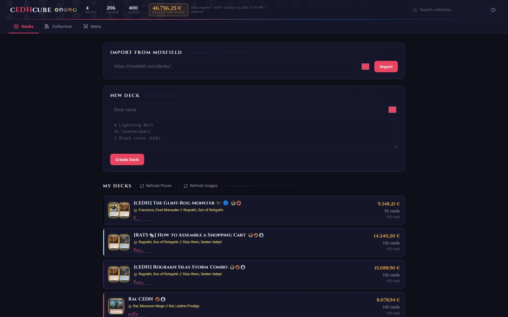
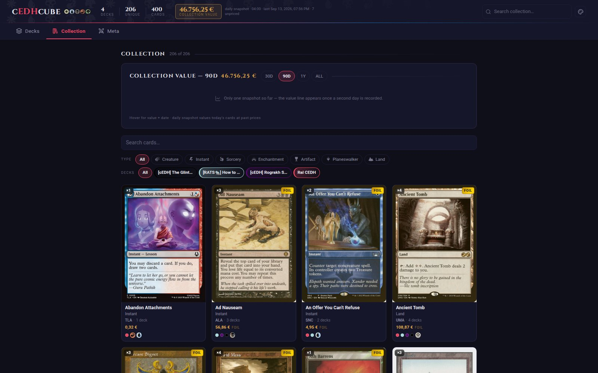
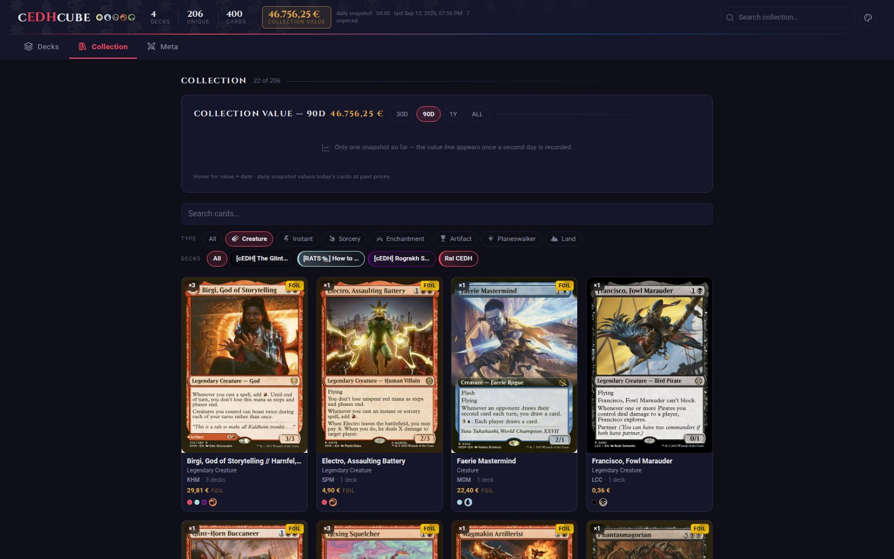
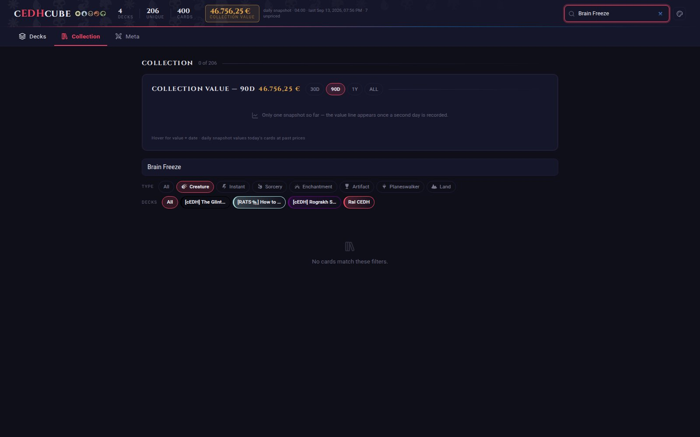
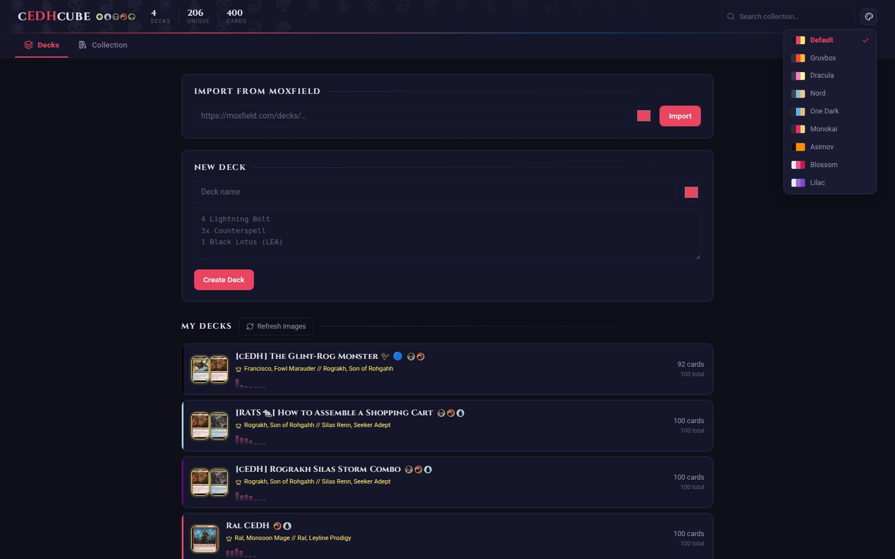
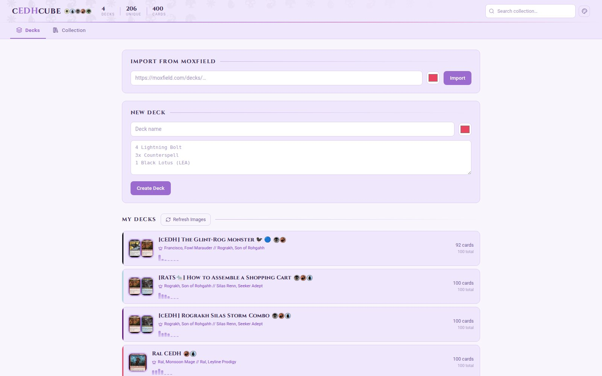
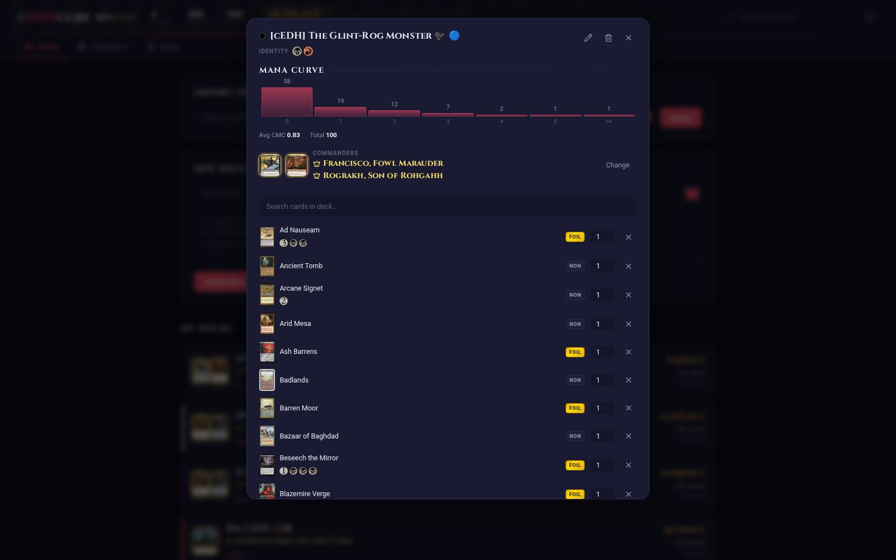
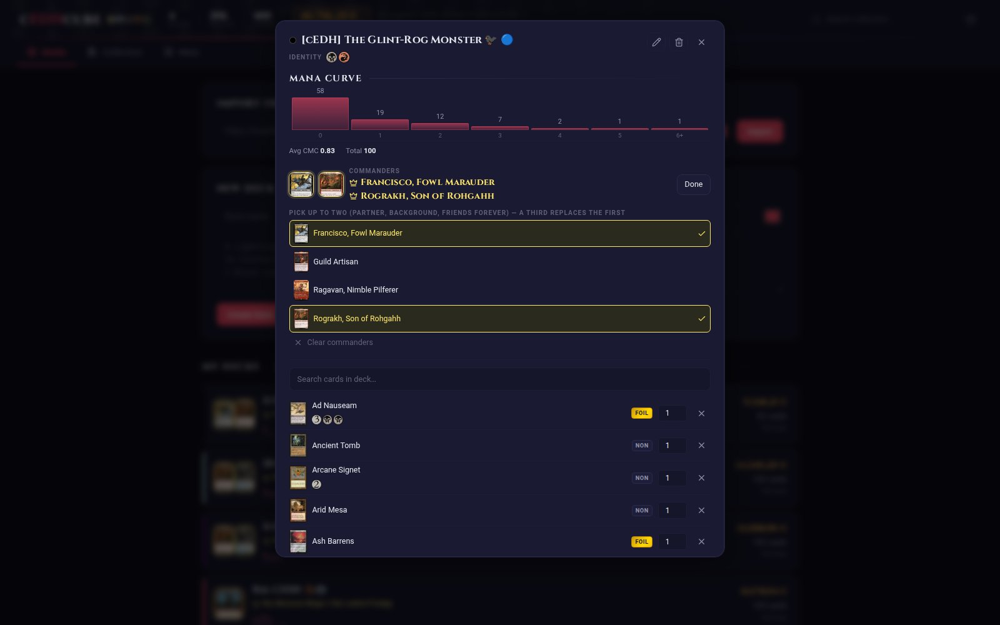
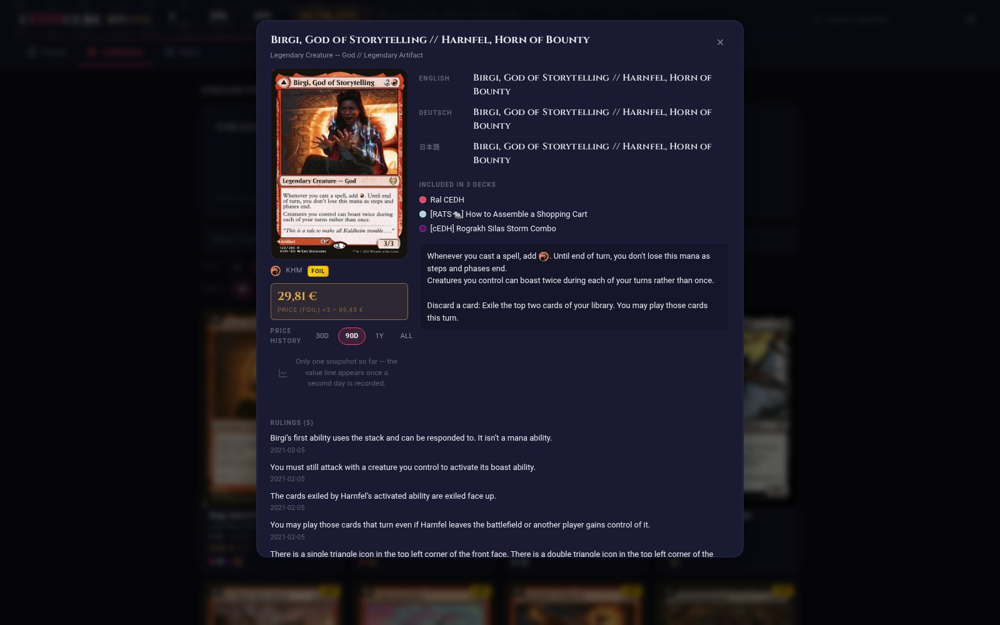

# cEDHcube

A clean, artsy, single-page app for tracking Magic: The Gathering Commander decks and your card collection across them. Built with a **FastAPI** backend and a **React + Vite + TypeScript + Tailwind** frontend, with live data pulled from Scryfall and Moxfield.

This README is a visual tour of every major screen and feature.

---

## Decks tab

The landing view. The header carries the wordmark, a live stat strip (deck / unique-card / total-card counts), a global collection search, and a theme switcher — all using authentic MTG mana symbols (via `mana-font`) instead of emoji. Below it: the Moxfield import box, the manual deck-creation box, and the deck list itself.

Each deck row shows its commander art (or **both** commander portraits side-by-side for partner/co-commander decks), name, color identity pips, and a live mini mana curve.



---

## Collection tab

Every unique card across all your decks, in a card-frame-styled grid: quantity badge, foil badge (shimmering gold), set code, color identity, and small dots showing which decks contain the card. Filter by card type (using real mana-font type icons) or by individual deck.



### Type filtering

Click a card-type pip (Creature, Instant, Sorcery, …) to narrow the grid instantly — active filter highlighted in the deck's accent color.



### Global search

The search box in the header works from anywhere in the app: typing a card name and hitting Enter jumps straight to the Collection tab, pre-filtered to matching cards.



---

## Theming

Nine built-in color themes — Default, Gruvbox, Dracula, Nord, One Dark, Monokai, and Asimov match their editor namesakes' authentic palettes, plus two soft light themes, **Blossom** (pink) and **Lilac** (lavender). Switchable from the header without a page reload; preference is remembered in `localStorage`. Mana symbols always keep their canonical WUBRG colors regardless of theme — matching every real MTG product.





---

## Deck modal

Click any deck to open its full view: mana curve chart, commander section, a searchable card list with per-card foil toggle and quantity editor, and an "Add cards" box that resolves pasted card lists against Scryfall.

**Partner / co-commander decks** are fully supported — when a deck has two commanders (Partner, Partner With, Friends Forever, or Choose a Background), both are shown together under "Commanders" with their portraits and names.



### Commander picker

Click "Change" to open the picker. You can select **up to two** commanders from the deck's legendary creatures (and Background enchantments) — a third pick evicts the oldest selection. Selected cards are checked and highlighted; "Clear commanders" resets both slots.



---

## Card detail modal

Clicking any card in the Collection tab opens a detail view: full card art, localized names (English / Deutsch / 日本語), which decks it's currently in, full oracle text (with real mana-symbol pips inline, e.g. `{T}`, `{2}`), and official Scryfall rulings.



---

## Tech stack

| Layer | Stack |
|---|---|
| Backend | FastAPI + SQLite, single `app.py` route file, `database.py` for all SQL |
| Card data | Scryfall API (lookup, images, localization, rulings) |
| Deck import | Moxfield API (via `cloudscraper` to get past its Cloudflare challenge) |
| Frontend | React + Vite + TypeScript, Tailwind v4 |
| Icons/symbols | `mana-font` (official-style WUBRG mana glyphs), `lucide-react` (UI icons) |
| Typography | Cinzel (headings/wordmark), system sans-serif (body) |

## Running locally

```bash
# Backend (FastAPI, port 8000)
cd ~/magic-collection
./venv/bin/python -m uvicorn app:app --reload --port 8000 --host 0.0.0.0

# Frontend (Vite dev server, port 5173, proxies /api to the backend)
cd ~/magic-collection/frontend
npx vite --host 0.0.0.0 --port 5173
```

Open **http://localhost:5173**.

## Regenerating these screenshots

`docs/shoot.js` is a Playwright script that walks the running app and captures every screen shown above. With both dev servers running:

```bash
cd ~/magic-collection/docs
npm install playwright --no-save   # first time only
npx playwright install chromium    # first time only
node shoot.js
```

Screenshots are written to `docs/screenshots/`.
