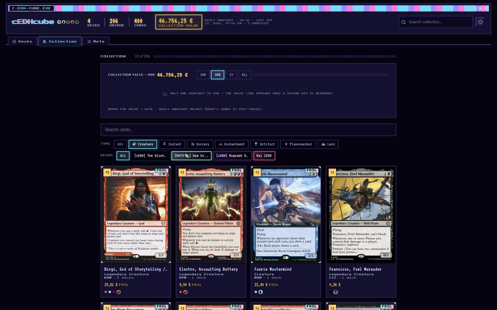
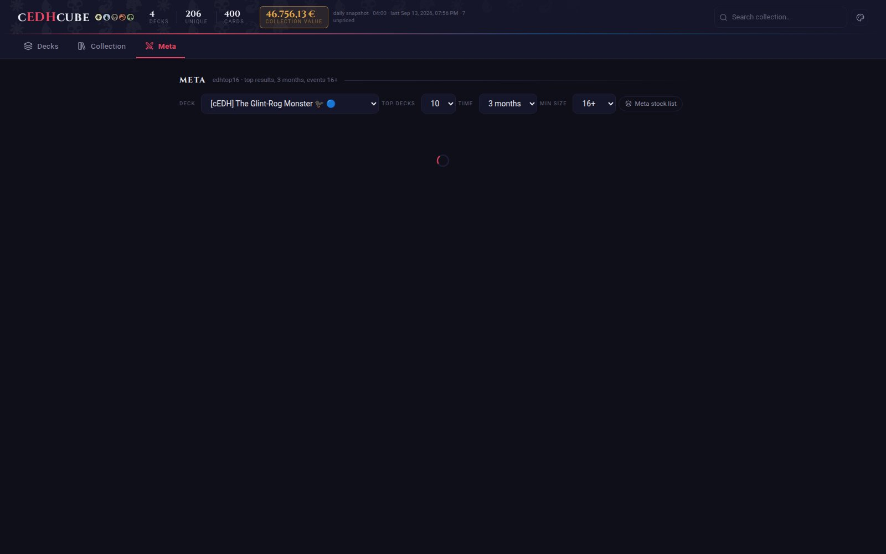

# cEDHcube

A clean, artsy, single-page app for tracking Magic: The Gathering Commander decks, your card collection across them, and how those decks stack up against the competitive meta. Built with a **FastAPI** backend and a **React + Vite + TypeScript + Tailwind** frontend, with live data from Scryfall, Moxfield, and a EUR paper-value engine.

This README is a visual tour of every major screen and feature.

---

## Decks tab

The landing view. The header carries the wordmark, a live stat strip (deck / unique-card / total-card counts), a **Collection Value** HUD (your whole collection at current EUR paper value, refreshed by a daily snapshot), a global collection search, and a theme switcher — all using authentic MTG mana symbols (via `mana-font`) instead of emoji. Below it: the Moxfield import box, the manual deck-creation box, and the deck list itself.

Each deck row shows its commander art (or **both** commander portraits side-by-side for partner/co-commander decks), name, color identity pips, and a live mini mana curve.


---

## Collection tab

Every unique card across all your decks, in a card-frame-styled grid: quantity badge, foil badge (shimmering gold), set code, color identity, **current EUR price**, and small dots showing which decks contain the card. Filter by card type (using real mana-font type icons) or by individual deck. Above the grid sits the **Collection Value** history panel — a hand-rolled SVG line chart tracking your total value over time, with one line per deck (30D / 90D / 1Y / ALL windows, hover for exact values).


### Type filtering

Click a card-type pip (Creature, Instant, Sorcery, …) to narrow the grid instantly — active filter highlighted in the deck's accent color.


### Global search

The search box in the header works from anywhere in the app: typing a card name and hitting Enter jumps straight to the Collection tab, pre-filtered to matching cards.


---

## Valuing your collection

EUR paper prices ride the existing Scryfall fetches — no extra calls. Scryfall's `prices` come back on every card the app already requests, so each deck card and collection entry shows a live unit price (foil-aware, with the other finish as fallback), and every deck, the header HUD, and the collection grid surface their paper value. A daily snapshot (04:00, plus catch-up at startup) records each card's price into `price_history`, powering the collection value chart above and the per-card sparkline in the card detail modal. Prices are deliberately EUR-only and surface with a distinct "money" accent, not the theme accent.

## Theming

Ten built-in color themes — Default, Gruvbox, Dracula, Nord, One Dark, Monokai, and Asimov match their editor namesakes' authentic palettes, plus two soft light themes, **Blossom** (pink) and **Lilac** (lavender). The tenth, **Cybercore**, is a deliberately rough, nostalgic Y2K/old-internet skin: midnight-void background, Press Start 2P pixel accent + VT323 CRT monospace, beveled Win95-style buttons, an OS-window title bar, glitch wordmark, and scanline/dither effects. Switchable from the header without a page reload; preference is remembered in `localStorage`. Mana symbols always keep their canonical WUBRG colors regardless of theme — matching every real MTG product.




---

## Deck modal

Click any deck to open its full view: mana curve chart, commander section, a searchable card list with per-card foil toggle, quantity editor and price, and an "Add cards" box that resolves pasted card lists against Scryfall.

**Partner / co-commander decks** are fully supported — when a deck has two commanders (Partner, Partner With, Friends Forever, or Choose a Background), both are shown together under "Commanders" with their portraits and names.


### Commander picker

Click "Change" to open the picker. You can select **up to two** commanders from the deck's legendary creatures (and Background enchantments) — a third pick evicts the oldest selection. Selected cards are checked and highlighted; "Clear commanders" resets both slots.


---

## Card detail modal

Clicking any card in the Collection tab opens a detail view: full card art, a **price box** (unit price, owned quantity, and the product) plus a **price-history sparkline**, localized names (English / Deutsch / 日本語), which decks it's currently in, full oracle text (with real mana-symbol pips inline, e.g. `{T}`, `{2}`), and official Scryfall rulings.


---

## Meta tab

Pick a deck and see how its commander(s) are performing on **edhtop16** — real cEDH tournament results live from the competitive meta. The toolbar lets you choose the deck, how many top decks to pull, the time window (3 months / 1 month / 6 months / 1 year / post-ban / all time) and a minimum event size; the overview lists recent top placements (standing, player, tournament, wins). Click an entry to open a **three-column side-by-side comparison** against your own list — *Meta plays, you don't* / *You play, meta doesn't* / *In both* — with `art_crop` card thumbnails and a hover full-card preview. A **Meta stock list** view aggregates what every analyzed top-N deck runs, flags the cards you're missing, and lets you toggle *only show what I'm missing*.



---

## Tech stack

| Layer | Stack |
|---|---|
| Backend | FastAPI + SQLite, single `app.py` route file, `database.py` for all SQL |
| Card data | Scryfall API (lookup, images, localization, rulings, prices) |
| Deck import | Moxfield API (via `cloudscraper` to get past its Cloudflare challenge) |
| Meta data | edhtop16 GraphQL API (competitive cEDH results, proxied server-side) |
| Frontend | React + Vite + TypeScript, Tailwind v4 |
| Charts | Hand-rolled SVG (mana curve + price history/sparklines) — no charting library |
| Icons/symbols | `mana-font` (official-style WUBRG mana glyphs), `lucide-react` (UI icons) |
| Typography | Cinzel (headings/wordmark), system sans-serif + Press Start 2P / VT323 (Cybercore) |

## Running locally

```bash
# Backend (FastAPI, port 8000)
cd ~/magic-collection
./venv/bin/python -m uvicorn app:app --reload --port 8000 --host 0.0.0.0

# Frontend (Vite dev server, port 5173, proxies /api to the backend)
cd ~/magic-collection/frontend
npx vite --host 0.0.0.0 --port 5173
```

Open **http://localhost:5173**.

## Regenerating these screenshots

`docs/shoot.js` is a Playwright script that walks the running app and captures every screen shown above. With both dev servers running:

```bash
cd ~/magic-collection/docs
npm install playwright --no-save   # first time only
npx playwright install chromium    # first time only
node shoot.js
```

Screenshots are written to `docs/screenshots/` as PNGs (convert to the JPEGs above with Pillow at quality 85). Note the price-history shots need two or more recorded snapshots to render a line — run once, let a second day's snapshot accumulate, then re-shoot.